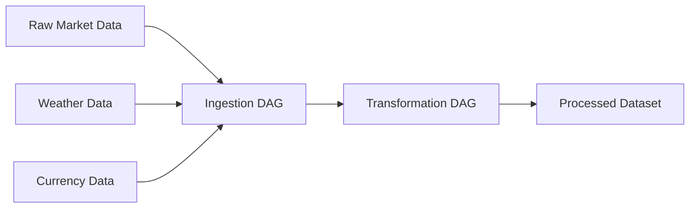
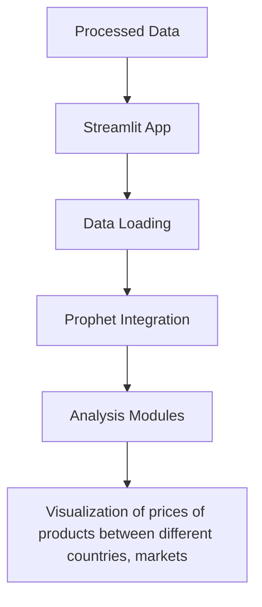

# Product Price Analysis Project Documentation

## Project Overview
This project analyzes product pricing patterns across different markets using Airflow for data processing, Streamlit for visualization and analysis, and Prophet for price forecasting. The analysis focuses on three main aspects: seasonal pricing patterns, weather impacts, and currency fluctuations.

## Technical Stack & Architecture
- **Data Pipeline**: Apache Airflow
  - Handles data ingestion
  - Performs data transformations
  - Outputs processed data for analysis
- **Analysis & Visualization**: Streamlit
  - Interactive dashboard interface
  - Integration with Prophet for forecasting
  - Real-time data analysis
- **Forecasting**: Prophet
  - Called directly from Streamlit
  - Time series forecasting
  - Seasonal pattern detection

## Pipeline Structure

### 1. Airflow DAG

#### Ingestion Process
- Raw data collection from various sources
- Data validation and cleaning
- Initial formatting and structuring

#### Transformation Process
- Data aggregation
- Feature engineering (standardize units, imputation of data)
- Output preparation for Streamlit

### 2. Streamlit Application

#### Application Structure

#### Prophet Integration
- Direct calls to Prophet from Streamlit
- Real-time forecasting based on selected filters (country, locality, product)
- Regressors integration with the temperature and the precipitation fields.

## Research Questions & Implementation

### 1. Seasonal Price Variations by Market

#### Analysis Implementation
- Data loading from Airflow output
- Prophet model configuration in Streamlit
- Seasonal component extraction
- Interactive visualization of patterns

#### Key Visualizations
- Seasonal trend decomposition

- Actual pricing variability per product

- Market comparison on prices per product (price in USD)

### 3. Currency Fluctuation Impact
The currency was changed for every data point to USD using the historical equivalent, and the prices were adjusted in the staging layer.